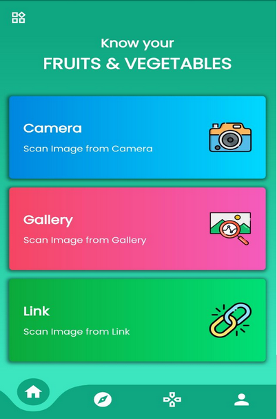
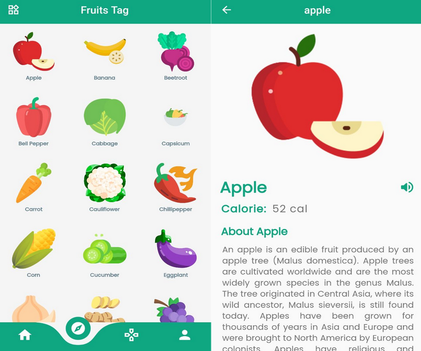
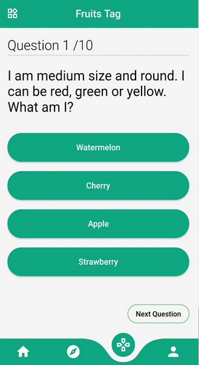
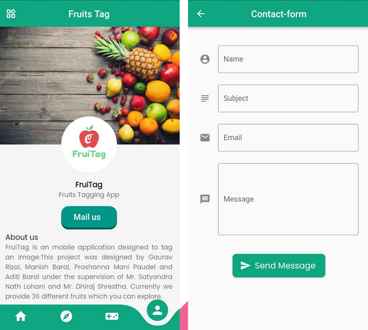

# Fruitstagging
FruitTag is a mobile application that identifies certain fruits and vegetables which aims to make it easier for people to recognize unknown fruits. It 
Allows user to input image either from camera or gallery or Image url and uses machine learning model to identify the fruits.For the moment we have 36 data
sets through which we provide brief information about the scanned/ tagged fruits. It also Contains quiz for user to test their knowledge of fruits.

TEAM
ADITI BARAL             https://github.com/AditiBaral
MANISH BARAL            https://github.com/K-adu
PRASHANNA MANI PAUDEL   https://github.com/PMP56
GAURAV RIZAL            https://github.com/physicistgaurav

HOME PAGE  

 

FRUIT DETAIL PAGE  

 

QUIZ GAME  

 

CONTACT US FORM  

